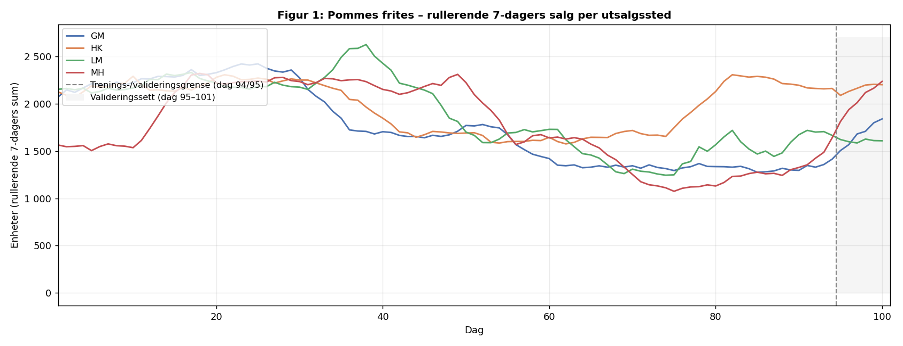
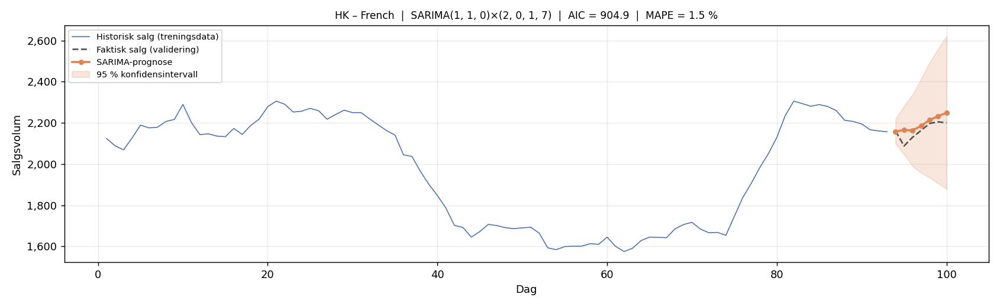
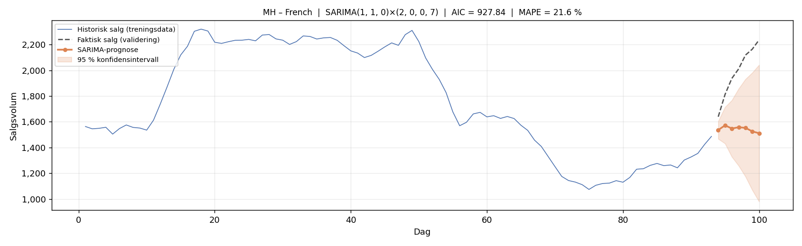
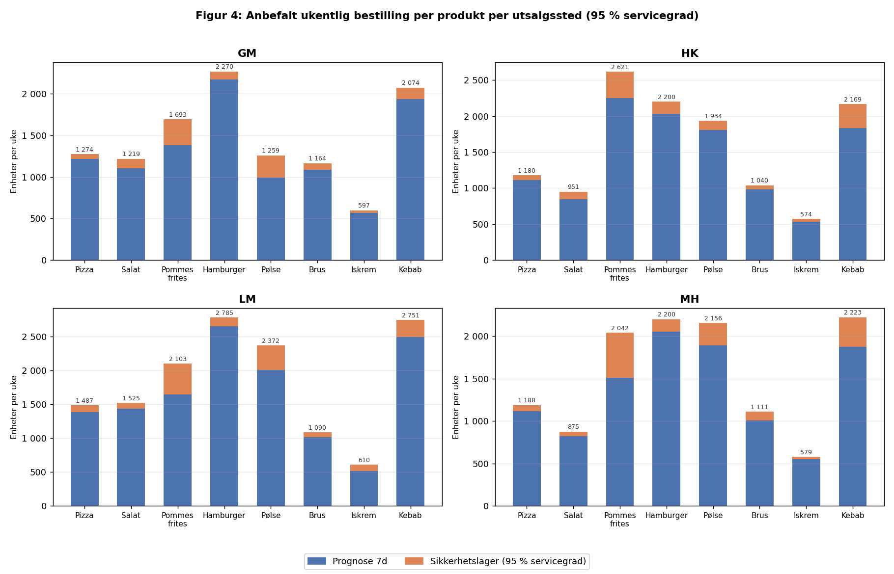

# Optimal lagerbeholdning for BiteBurst: En SARIMA-basert tilnærming til prognose og sikkerhetslager

**Forfatter:** Kjetil Tronstad Lund

**Totalt antall sider inkludert forsiden:**

**Molde, 31. mai 2026**

---

## Obligatorisk egenerklæring

Den enkelte student er selv ansvarlig for å sette seg inn i hva som er lovlige hjelpemidler, retningslinjer for bruk av disse og regler om kildebruk. Erklæringen skal bevisstgjøre studentene på deres ansvar og hvilke konsekvenser fusk kan medføre. Manglende erklæring fritar ikke studentene fra sitt ansvar.

---

## Personvern

### Personopplysningsloven

**Har oppgaven vært vurdert av NSD?** nei

- Jeg erklærer at oppgaven ikke omfattes av Personopplysningsloven. Datagrunnlaget består utelukkende av simulerte salgsdata fra dataspillet Big Ambitions og inneholder ingen personopplysninger.

### Helseforskningsloven

**Har oppgaven vært til behandling hos REK?** nei

---

## Publiseringsavtale

**Studiepoeng:**

**Veileder:**

**Jeg/vi gir herved Høgskolen i Molde en vederlagsfri rett til å gjøre oppgaven tilgjengelig for elektronisk publisering:** ja

**Er oppgaven båndlagt (konfidensiell)?** nei

**Dato:**

---

## Sammendrag

Denne rapporten undersøker hvordan historiske salgsdata kan benyttes til å fastsette optimalt lagernivå for hvert av fire hurtigmatutsalgssteder i den fiktive bedriften BiteBurst. Datagrunnlaget er hentet fra dataspillet Big Ambitions og består av 101 dagers daglige salgsdata for åtte produktkategorier per utsalgssted.

Analysen avdekket statistisk signifikante ukentlige salgsmønstre, noe som motiverte valget av sesong-ARIMA (SARIMA) som prognosemodell med en ukesperiode på syv dager. Modellparametere ble valgt automatisk via auto_arima basert på AIC-kriteriet, og det ble tilpasset 32 individuelle modeller – én per produkt per utsalgssted.

Resultatene viser at SARIMA-modellene predikerer etterspørselen med god nøyaktighet for de fleste produkter, med gjennomsnittlig absolutt prosentfeil (MAPE) på 1–7 % for majoriteten. Høyere usikkerhet ble observert for Pommes frites og Pølse i utvalgte utsalgssteder. Basert på prognosene og et sikkerhetslager beregnet for 95 % servicegrad presenteres konkrete lagernivåanbefalinger per produkt per utsalgssted, som gir hvert sted grunnlag for syv dagers drift uten levering fra sentrallager. Rapporten diskuterer også modellenes begrensninger og mulighetene for å overføre metodikken til reelle forretningsdata.

## Abstract

This report investigates how historical sales data can be used to determine optimal inventory levels for four fast-food outlets in the fictional company BiteBurst. The data was collected from the simulation game Big Ambitions and consists of 101 days of daily sales data across eight product categories per outlet.

Analysis revealed statistically significant weekly sales patterns, motivating the choice of Seasonal Autoregressive Integrated Moving Average (SARIMA) as the forecasting model with a seasonal period of seven days. Model parameters were selected automatically via auto_arima based on the AIC criterion, resulting in 32 individual models – one per product per outlet.

Results show that SARIMA models predict demand with high accuracy for most products, with mean absolute percentage error (MAPE) of 1–7 % for the majority. Higher uncertainty was observed for Pommes frites and Pølse at selected outlets. Based on the forecasts and a safety stock calculated for a 95 % service level, specific recommended stock levels per product per outlet are reported, enabling each outlet to operate for seven days without replenishment from the central warehouse. The report also discusses model limitations and the potential for applying the methodology to real business data.

---

## Innhold

1. [Innledning](#1-innledning)
   - 1.1 [Problemstilling](#11-problemstilling)
   - 1.2 [Avgrensninger](#12-avgrensninger)
   - 1.3 [Antagelser](#13-antagelser)
2. [Litteratur](#2-litteratur)
3. [Teori](#3-teori)
4. [Casebeskrivelse](#4-casebeskrivelse)
5. [Metode og data](#5-metode-og-data)
   - 5.1 [Metode](#51-metode)
   - 5.2 [Data](#52-data)
6. [Modellering](#6-modellering)
7. [Analyse](#7-analyse)
8. [Resultat](#8-resultat)
9. [Diskusjon](#9-diskusjon)
10. [Konklusjon](#10-konklusjon)
11. [Bibliografi](#11-bibliografi)
12. [Vedlegg](#12-vedlegg)

---

## 1 Innledning

Effektiv lagerstyring er en av de mest kritiske faktorene for lønnsomheten i detaljhandel og serveringsbransjen. En mangelsituasjon – ofte omtalt som stockout – innebærer at et produkt ikke er tilgjengelig når kundene etterspør det, noe som resulterer i tapte inntekter, redusert kundetilfredshet og i verste fall varig tap av kunder. På den andre siden medfører overlagring unødvendig kapitalbinding, økte lagerkostnader og risiko for at ferskvarer ikke kan benyttes. Den grunnleggende utfordringen for enhver varehandler er å balansere disse to motsigende hensynene ved å opprettholde et lagernivå som er høyt nok til å dekke etterspørselen, men lavt nok til at kapitalen utnyttes effektivt (Silver et al., 2017).

Tradisjonelle tilnærminger til lagerstyring baserer seg på gjennomsnittlig etterspørsel og statistiske mål for variasjon for å beregne sikkerhetslager og bestillingspunkter. I takt med økt datatilgjengelighet har imidlertid kvantitative prognosemetoder blitt stadig mer utbredt. Blant disse har tidsrekkemodeller som ARIMA og dens sesongbaserte utvidelse SARIMA vist seg å være godt egnet for etterspørselsprognoser i detaljhandelen, særlig der salgsdata viser sesongmønstre eller autokorrelasjon over tid (Hyndman & Athanasopoulos, 2021). En viktig fordel med slike statistiske modeller er at de kan fange opp strukturen i historiske data og produsere prognoser med tilhørende usikkerhetsintervaller, som kan benyttes direkte til å dimensjonere sikkerhetslager.

Denne rapporten tar utgangspunkt i den fiktive hurtigmatbedriften BiteBurst, som opererer fire utsalgssteder i dataspillet Big Ambitions (Hovgaard & Hovgaard, 2022). Spillet simulerer driften av utsalgssteder med en konsistent etterspørselslogikk og gir dermed en kontrollert setting der salgsdata kan samles inn og analyseres uten å ta hensyn til konfidensielle forretningsopplysninger. Med 101 dager med daglige salgsdata per utsalgssted for åtte produktkategorier danner datagrunnlaget en solid basis for tidsrekkeanalyse.

Formålet med rapporten er å undersøke hvordan SARIMA-basert prognosemodellering kan benyttes til å fastsette det optimale lagernivået hvert utsalgssted må holde for å kunne operere i syv dager uten levering fra sentrallager. Et slikt lagernivå er særlig relevant i situasjoner der leveringsforsinkelser eller andre driftsforstyrrelser hindrer ordinær påfylling. Rapporten bidrar til å demonstrere en praktisk og reproduserbar metodikk for lageroptimalisering basert på historiske salgsdata, der en åpen kildekode-løsning i Python automatiserer modellvalg og beregninger.

Rapportens struktur følger en klassisk vitenskapelig oppbygning. Etter en gjennomgang av relevant litteratur og det teoretiske grunnlaget for SARIMA-modellering og sikkerhetslagerberegning beskrives casebedriften og datagrunnlaget i detalj. Metode- og modelleringskapitlene dokumenterer den analytiske prosessen, fulgt av resultater og diskusjon. Rapporten avsluttes med en konklusjon som besvarer problemstillingen.

### 1.1 Problemstilling

Rapporten tar utgangspunkt i følgende problemstilling:

> *Hvordan kan SARIMA-basert etterspørselsprognose benyttes til å fastsette optimalt lagernivå per produkt per utsalgssted for hurtigmatbedriften BiteBurst, slik at hvert utsalgssted kan operere i syv dager uten levering fra sentrallager?*

For å strukturere analysen deles problemstillingen inn i to delspørsmål:

1. Hvilken SARIMA-modell beskriver etterspørselen best for hvert produkt per utsalgssted, målt ved Akaike informasjonskriterium (AIC) og gjennomsnittlig absolutt prosentfeil (MAPE)?
2. Hva er det anbefalte lagernivået per produkt per utsalgssted ved 95 % servicegrad, basert på SARIMA-prognosene og tilhørende konfidensintervaller?

### 1.2 Avgrensninger

Følgende avgrensninger er gjort for å holde problemstillingen håndterbar og analysene fokuserte.

**Produktutvalg:** Rapporten omfatter alle åtte produktkategoriene som selges i samtlige av BiteBursts utsalgssteder: Pizza, Salat, Pommes frites, Hamburger, Pølse, Brus, Iskrem og Kebab. Opprinnelig var omfanget avgrenset til 4–5 produkter, men siden alle åtte er felles for alle utsalgsstedene og datagrunnlaget er komplett, ble det besluttet å inkludere samtlige for et mer fullstendig analysegrunnlag.

**Kostnadsmodell:** Det inkluderes ikke eksplisitte kostnader for ansatte, lokaler eller utsalgspris i analysen. Fokus er utelukkende på etterspørselsprognose og lagernivåanbefaling, ikke på en fullstendig totaløkonomisk optimalisering.

**Datagrunnlag:** Analysen baserer seg utelukkende på simulerte data fra Big Ambitions. Resultatene skal ikke generaliseres direkte til reelle hurtigmatkjeder uten videre validering mot faktiske forretningsdata.

**Bestillingsfrekvens:** Det antas at utsalgsstedene mottar levering fra sentrallager én gang per uke, og at lagernivåene fastsettes for en planleggingshorisont på syv dager.

**Sentrallager:** Rapporten ser bort fra sentrallageret som en separat analyseenhet. Fokus er på lagernivåene i de fire utsalgsstedene.

### 1.3 Antagelser

Følgende antagelser er lagt til grunn for analysen.

**Representativitet:** Det antas at salgsdata fra Big Ambitions er tilstrekkelig representative til å identifisere etterspørselsmønstre. Spillets etterspørselslogikk er konsistent og ble ikke påvirket av oppdateringer i observasjonsperioden.

**Ukessyklus:** Statistisk analyse avdekket signifikant autokorrelasjon ved lag 7 for flere produkter og utsalgssteder, noe som bekrefter at en ukentlig sesongperiode er til stede i dataene (jf. kapittel 5.1). Det antas at disse mønstrene er stabile og at en sesongperiode på syv dager er korrekt. Det bemerkes at prosjektets opprinnelige planleggingsdokument antok at ingen sesongvariasjoner fantes i dataene. Denne antagelsen ble avkreftet av den statistiske analysen og er justert her.

**Servicegrad:** En servicegrad på 95 % antas å være et hensiktsmessig mål for å balansere stockout-risiko mot lagerkostnader. Dette tilsvarer en z-verdi på 1,645 under normalfordelingsantagelsen.

**Etterspørselsfordeling:** Det antas at prognosefeil er tilnærmet normalfordelte, slik at normalfordelingens z-verdier kan benyttes til å beregne sikkerhetslager fra modellenes konfidensintervaller.

---

## 2 Litteratur

Forskning på etterspørselsprognoser og lagerstyring spenner over et bredt felt av metoder og anvendelsesområder. Dette kapittelet gir en oversikt over sentrale bidrag som er relevante for problemstillingen i denne rapporten: bruken av SARIMA-modeller til etterspørselsprognoser og den direkte koblingen til sikkerhetslagerberegning.

### 2.1 ARIMA og SARIMA i etterspørselsprognoser

Det metodologiske fundamentet for ARIMA-modellering ble lagt av Box, Jenkins, Reinsel og Ljung (2015) i standardverket *Time Series Analysis: Forecasting and Control*, som gjennom flere tiår har vært referansepunktet for praktisk tidsrekkemodellering. Box og Jenkins introduserte den identifiserings-estimerings-diagnostikk-syklusen som ligger til grunn for manuell modellvalg, og som er automatisert i moderne verktøy som `auto_arima`. Sesongkomponenten i SARIMA-modellen adresserer et grunnleggende fenomen i handelssektoren: at etterspørselen varierer systematisk med ukedagen, måneden eller årstiden, og at denne variasjonen er målbar og kan utnyttes i prognosene.

Hyndman og Athanasopoulos (2021) gir i *Forecasting: Principles and Practice* en bred og tilgjengelig gjennomgang av hele spekteret fra eksponentiell utjevning til ARIMA-modeller, og er en sentral kilde for vurderingen av AIC som informasjonskriterium samt for tolkning av ACF og PACF-diagnostikk. Forfatterne understreker at automatiske modellvalgsalgoritmer – som stepwise-søket i `auto_arima` – i praksis gir resultater på linje med manuell modellvalg for de fleste datasett, mens beregningstiden reduseres dramatisk når et stort antall modeller skal tilpasses. Dette er direkte relevant for dette prosjektet der 32 individuelle modeller ble tilpasset.

Bruken av SARIMA for daglige salgsdata i mat- og detaljhandel er dokumentert i litteraturen. Fellesnevneren er at daglige salgsdata fra serveringssteder og dagligvarehandel nesten alltid viser en signifikant ukentlig sesongkomponent, siden handlevanene til forbrukerne er tett koblet til ukesrytmen med toppunkter i helgene og lavere aktivitet midt i uken (Hyndman & Athanasopoulos, 2021). SARIMA med sesongperiode *s* = 7 er dermed et naturlig valg for slike data, noe som bekreftes av at alle 32 modeller i dette prosjektet fikk valgt en sesongkomponent automatisk.

### 2.2 Lagerstyring og sikkerhetslager

Den klassiske teorien for sikkerhetslager tar utgangspunkt i at etterspørselen er stokastisk og at målet er å fastsette et lagernivå som balanserer stockout-risiko mot lagerkostnader. Silver, Pyke og Thomas (2017) gir en samlet fremstilling av metodene for bestillingspunktsmodeller, servicegradbegreper og beregning av sikkerhetslager under ulike fordelingsantagelser. Den klassiske formelen *SS = z_α · σ_L* er en direkte implementasjon av denne teorien, der z-verdien fra normalfordelingen kobler den ønskede servicegraden til det nødvendige lagernivået. Forutsetningen om normalfordelte prognosefeil er en forenkling som fungerer godt for produkter med jevn og relativt stabil etterspørsel, men som kan undervurdere risikoen for produkter med tunge haler i fordelingen eller systematiske trender.

Chopra og Meindl (2019) setter lagerstyringen inn i et bredere forsyningskjedeperspektiv og understreker at den optimale lagerpolitikken ikke kan ses isolert fra bestillingsfrekvens, ledetid og leverandørvariabilitet. I BiteBurst-konteksten er disse parameterne relativt enkle: ukentlig bestillingssyklus og ingen eksplisitt ledetidsvariasjon. Dette forenkler sikkerhetslagerberegningen til å handle primært om etterspørselsvariasjon over en fast planleggingshorisont, noe SARIMA-konfidensintervallene er godt egnet til å kvantifisere.

### 2.3 Integrering av prognose og lagerstyring

En viktig utvikling i litteraturen er koblingen mellom statistiske prognosemodeller og sikkerhetslagerberegning. Fremfor å bruke historisk standardavvik som en separat inputparameter til sikkerhetslageret, utnytter den tilnærmingen som er benyttet i denne rapporten – direkte avlesning av konfidensintervaller fra SARIMA-modellen – den modellspesifikke usikkerheten slik den er estimert av modellen selv. Fordelen er at sikkerhetslageret automatisk vil være høyere for produkter og perioder der modellen er usikker, og lavere der modellen er presis, uten at dette krever separate vurderinger for hvert produkt (Silver et al., 2017). Denne tilnærmingen er i tråd med prinsippet om at prognose og lagerdimensjonering bør behandles som en integrert prosess fremfor to adskilte trinn.

---

## 3 Teori

### 3.1 Tidsrekker og stasjonæritet

En tidsserie er en sekvens av observasjoner samlet over tid i jevne tidsintervaller. For at klassiske statistiske metoder skal kunne benyttes direkte på tidsrekkedata, er det en forutsetning at serien er stasjonær – det vil si at seriens statistiske egenskaper, særlig gjennomsnitt og varians, er konstante over tid (Hyndman & Athanasopoulos, 2021). Mange reelle tidsrekker er ikke-stasjonære: de kan oppvise trender, sesongsvingninger eller endringer i variansen over tid.

En vanlig teknikk for å oppnå stasjonæritet er differensiering, der man erstatter de originale verdiene med differansen mellom påfølgende observasjoner. Graden av differensiering betegnes med *d*, slik at *d* = 1 innebærer at man tar første-ordens differansen Δy_t = y_t − y_{t−1}, og *d* = 2 innebærer ytterligere differensiering. Augmented Dickey-Fuller-testen (ADF) er en standard statistisk test for å undersøke om en tidsserie inneholder en enhetsrot, noe som er ensbetydende med ikke-stasjonæritet. En signifikant ADF-testverdi (p < 0,05) indikerer at nullhypotesen om enhetsrot kan forkastes, og at serien er stasjonær (Box et al., 2015).

### 3.2 ARIMA-modellen

ARIMA(p, d, q) – Autoregressive Integrated Moving Average – er en familie av modeller for å beskrive og prognostisere tidsrekker (Box et al., 2015). Modellen har tre komponenter:

**Autoregressive (AR) ledd** av orden *p* betyr at den nåværende verdien modelleres som en lineær kombinasjon av de *p* foregående verdiene:

$$y_t = c + \varphi_1 y_{t-1} + \varphi_2 y_{t-2} + \cdots + \varphi_p y_{t-p} + \varepsilon_t$$

der *φ_i* er autoregresjonskoeffisientene og *ε_t* er hvit støy.

**Integrated (I) komponent** av orden *d* angir at serien er differensiert *d* ganger for å oppnå stasjonæritet. For *d* = 1 opererer modellen på den differensierte serien Δy_t = y_t − y_{t−1}.

**Moving Average (MA) ledd** av orden *q* inkluderer *q* tidligere prognosefeil som forklaringsvariabler:

$$y_t = \mu + \varepsilon_t + \theta_1 \varepsilon_{t-1} + \theta_2 \varepsilon_{t-2} + \cdots + \theta_q \varepsilon_{t-q}$$

der *θ_i* er MA-koeffisientene.

Autokorrelasjonsfunksjonen (ACF) og den partielle autokorrelasjonsfunksjonen (PACF) er viktige diagnostiske verktøy for å identifisere passende *p*- og *q*-verdier. Et signifikant ACF-lag ved forsinkelse *k* indikerer at observasjoner med avstand *k* er korrelerte (Hyndman & Athanasopoulos, 2021).

### 3.3 SARIMA – sesongbasert utvidelse

SARIMA(p, d, q)(P, D, Q, s) er en utvidelse av ARIMA som inkluderer sesongkomponenter med periode *s* (Box et al., 2015). For ukentlige mønstre i daglige data settes *s* = 7. De store bokstavene *P*, *D*, *Q* angir henholdsvis sesong-AR-orden, sesongdifferensiering og sesong-MA-orden. SARIMA-modellen fanger dermed opp både kortsiktig autokorrelasjon (via *p*, *q*) og periodiske mønstre med periode *s* dager (via *P*, *Q*).

Et signifikant ACF-lag ved forsinkelse *s* (eller multipler av *s*) indikerer at sesongkomponenten er til stede i dataene og at en SARIMA-modell vil beskrive serien bedre enn en ren ARIMA-modell. Hyndman og Athanasopoulos (2021) anbefaler å inkludere sesongkomponenter dersom ACF-koeffisienten ved forsinkelse *s* er statistisk signifikant.

### 3.4 Informasjonskriterium og modellvalg

Akaike informasjonskriterium (AIC) er et mål for modellens tilpasning til dataene, justert for antall frie parametre (Hyndman & Athanasopoulos, 2021):

$$\text{AIC} = -2\ln(\hat{L}) + 2k$$

der *L̂* er den maksimale likelihooden og *k* er antallet estimerte parametre. En lavere AIC-verdi indikerer en bedre balanse mellom modellens tilpasning til treningsdataene og dens kompleksitet. AIC penaliserer dermed overparametriserte modeller og hjelper til med å unngå overtilpasning.

### 3.5 Sikkerhetslager og servicegrad

Sikkerhetslager er en buffer av varer som holdes utover den forventede etterspørselen, for å beskytte mot etterspørselsusikkerhet og leveringsvariasjon (Silver et al., 2017). For en gitt servicegrad α og normalfordelte prognosefeil kan sikkerhetslageret beregnes som:

$$SS = z_\alpha \cdot \sigma_L$$

der *z_α* er den korresponderende z-verdien fra normalfordelingen (for 95 % servicegrad er *z* = 1,645), og *σ_L* er standardavviket til prognosefeilen over planleggingshorisonten *L*.

I denne rapporten utnyttes at SARIMA-modellene leverer eksplisitte konfidensintervaller for prognosene. Det øvre konfidensintervallet for 7-dagerssummen ved 95 % nivå gir direkte det mengdenivået som dekker etterspørselen i 95 % av tilfellene. Sikkerhetslageret defineres derfor som differansen mellom det øvre konfidensintervallet og punktprognosen (jf. kapittel 6.4), som en praktisk implementasjon av den klassiske sikkerhetslagerformelen (Silver et al., 2017).

---

## 4 Casebeskrivelse

BiteBurst er en fiktiv hurtigmatkjede som driftes av én eier i dataspillet Big Ambitions (Hovgaard & Hovgaard, 2022). Big Ambitions er en forretningssimulator der spilleren bygger opp en virksomhet i New York fra grunnen av, og tar beslutninger om lokalisering, bemanning, sortiment, prissetting og leverandørrelasjoner. Spillet er utviklet av Hovgaard Games og har mottatt svært positive anmeldelser på Steam for sin dybde og realisme i forretningsmekanikken. For dette prosjektet er BiteBurst benyttet som et kontrollert simuleringsmiljø for å generere daglige salgsdata med en realistisk etterspørselslogikk, uten å måtte benytte konfidensielle data fra en reell bedrift.

### Utsalgsstedene

BiteBurst opererer fire hurtigmatutsalgssteder lokalisert i ulike bydeler i New York slik de fremstår i spillet. Tabell 1 gir en oversikt over stedene med forkortelse, bydel og trafikkscore.

**Tabell 1: Oversikt over BiteBursts utsalgssteder**

| Forkortelse | Bydel           | Trafikkscore | Maks. kapasitet |
|-------------|-----------------|-------------|-----------------|
| GM          | Garment District | 46          | 30 kunder/time  |
| HK          | Hell's Kitchen   | 39          | 30 kunder/time  |
| LM          | Lower Manhattan  | 40          | 30 kunder/time  |
| MH          | Murray Hill      | 38          | 30 kunder/time  |

Trafikkscore i Big Ambitions er et mål på potensiell kundestrøm til en eiendom basert på bydelens fottrafikk. Alle fire utsalgsstedene har identisk lokal kapasitet på maksimalt 30 kunder i timen, like store lokaler og identiske åpningstider. Utsalgsstedene er konfigurert uten bruk av spillfunksjoner som reklame eller kampanjer for å minimere eksterne påvirkningsfaktorer på salget.

Til tross for relativt sammenlignbare trafikkscore-verdier selger Lower Manhattan (LM) vesentlig mer enn de tre øvrige stedene, noe Tabell 2 illustrerer.

**Tabell 2: Ukentlig prognose per utsalgssted (alle produkter summert)**

| Utsalgssted | Prognose per uke (enheter) | Relativt til GM |
|-------------|---------------------------|-----------------|
| GM          | 10 469                    | 100 %           |
| HK          | 11 402                    | 109 %           |
| LM          | 13 158                    | 126 %           |
| MH          | 10 832                    | 103 %           |

Forklaringen ligger ikke i trafikkscoren alene, men i at Big Ambitions også opererer med en bydelsspesifikk *etterspørsel* som varierer mellom områder i spillet. Lower Manhattan er et høyaktivitetsområde i spillet med høyere innebygd etterspørsel etter hurtigmatprodukter enn de øvrige bydelene, noe som driver det høyere salgsvolumet. Dette skillet mellom trafikkscore og bydeletterspørsel er en viktig egenskap ved spillets simulering. For modelleringen innebærer det at individuelle SARIMA-modeller per utsalgssted er nødvendige, fremfor én felles modell for alle.

### Produktsortiment

Alle fire utsalgsstedene selger de samme åtte produktkategoriene: Pizza, Salat, Pommes frites, Hamburger, Pølse, Brus, Iskrem og Kebab. Produktene ble valgt av eier innenfor de valgmulighetene spillets forretningstype tillater, og representerer et bredt standardsortiment for en hurtigmatrestaurant. Innkjøpsprisen er identisk for alle utsalgssteder, mens utsalgsprisen kan variere. Siden kostnadsanalyse er avgrenset ut av rapporten (jf. kapittel 1.2), er dette ikke av direkte relevans for analysene.

### Forsyningskjeden

Forsyningskjeden i BiteBurst er bygget opp i to ledd. Utsalgsstedene mottar daglig levering fra et sentrallager som eier har opprettet, med levering hver natt klokken 02:00. Sentrallageret på sin side bestiller varer fra en grossist og mottar levering hver mandag klokken 08:00, noe som etablerer en ukentlig bestillingssyklus oppstrøms i kjeden.

Denne strukturen er direkte relevant for problemstillingen. Under normal drift fylles utsalgsstedenes lagre daglig fra sentrallageret. Den analytiske utfordringen rapporten adresserer er imidlertid dimensjoneringen av det interne lageret på hvert utsalgssted: hvor mye varer må hvert sted holde for å klare syv dagers drift dersom den daglige leveransen fra sentrallageret skulle falle bort? Svaret på dette spørsmålet er bestemmende for utsalgsstedenes beredskapslagernivå og er det sentrale resultatet i rapporten.

### Simuleringens styrker og begrensninger

En sentral styrke ved Big Ambitions som datagrunnlag er at simuleringen gir en konsistent etterspørselslogikk uten konfidensielle hensyn, og at data kan akkumuleres over en lengre periode enn det som normalt ville vært mulig å innhente fra en reell bedrift i et avgrenset prosjekt. Datainnsamlingen foregår manuelt ved daglig avlesning av salgstall i spillgrensesnittet, noe som setter et praktisk tak på observasjonsperioden og kan introdusere enkeltfeil i registreringen.

Det er viktig å understreke at Big Ambitions er et kommersielt underholdningsspill, og at den underliggende etterspørselslogikken ikke er transparent for spilleren. Hvorvidt spillets algoritmer gjenspeiler reelle etterspørselsmønstre i hurtigmatbransjen, er ikke mulig å verifisere direkte. Resultatene i denne rapporten bør tolkes med dette forbeholdet.

---

## 5 Metode og data

### 5.1 Metode

#### Begrunnelse for valg av SARIMA

Valget av SARIMA som prognosemodell ble motivert av to analyser gjennomført på de rensede salgsseriene: stasjonæritetstest og autokorrelasjonsanalyse.

**Stasjonæritetstesting (ADF):** Augmented Dickey-Fuller-testen ble anvendt på alle 32 salgsserier. For et flertall av produktene på alle utsalgssteder – spesielt de med moderat til sterk trend – ble nullhypotesen om enhetsrot ikke avvist på 5 %-nivå (p > 0,05). Dette indikerer ikke-stasjonæritet og nødvendiggjør differensiering, det vil si *d* ≥ 1. For produkter med relativt stabile nivåer (eksempelvis Iskrem og Brus) ble serien i noen tilfeller vurdert som nær-stasjonær, men sesongdifferensiering ble likevel vurdert separat.

**Autokorrelasjonanalyse (ACF):** For alle 32 serier ble ACF-koeffisienten ved lag 1 beregnet og funnet svært høy (0,77–0,99), noe som bekrefter sterk autokorrelasjon i daglige salgsdata. Av særlig interesse er lag 7: signifikante ACF-koeffisienter (|r| > 0,20) ved forsinkelse 7 ble observert for Pommes frites, Pølse, Kebab og Salat på tvers av utsalgsstedene. Disse funnene underbygger at det eksisterer en statistisk målbar ukentlig sesongkomponent i dataene, og at SARIMA med sesongperiode *s* = 7 er en bedre modellklasse enn ren ARIMA uten sesongleddet.

Samlet sett gir ADF-testen grunnlag for differensiering og ACF-analysen grunnlag for sesongkomponenten. SARIMA(p, d, q)(P, D, Q, 7) ble valgt som modellklasse for alle 32 kombinasjoner av produkt og utsalgssted.

#### Automatisk modellvalg med auto_arima

Modellparametrene (*p*, *d*, *q*, *P*, *D*, *Q*) ble valgt automatisk ved hjelp av funksjonen `auto_arima` fra Python-biblioteket pmdarima (Hyndman & Athanasopoulos, 2021). Funksjonen implementerer en trinnvis (*stepwise*) søkeprosedyr der parametre inkrementelt justeres og ulike modellkombinasjoner sammenlignes basert på AIC-verdien. Modellen med lavest AIC velges som den endelige modellen. Parameterrommet som ble utforsket var:

- *p*, *q*: 0–3 (ikke-sesongmessige AR- og MA-ledd)
- *d*: automatisk bestemt (basert på KPSS- og ADF-tester internt i `auto_arima`)
- *P*, *Q*: 0–2 (sesongmessige AR- og MA-ledd)
- *D*: automatisk bestemt
- Sesongperiode *s* = 7

#### Trenings- og valideringsopplegg

For å evaluere modellenes prediktive nøyaktighet ble de siste syv dagene (dag 95–101) holdt tilbake som valideringssett. Modellen ble tilpasset på treningsdataene (dag 1–94) og deretter benyttet til å prognostisere de syv påfølgende dagene. Gjennomsnittlig absolutt prosentfeil (MAPE) mellom prognose og faktisk valideringssett ble beregnet som mål på modellnøyaktighet:

$$\text{MAPE} = \frac{1}{n} \sum_{t=1}^{n} \left| \frac{y_t - \hat{y}_t}{y_t} \right| \times 100 \%$$

#### Sikkerhetslagerberegning

Sikkerhetslageret ble beregnet direkte fra SARIMA-modellens 95 %-konfidensintervall for 7-dagerssummen. Den øvre grensen for konfidensintervallet representerer det nivået som – gitt modellens estimerte usikkerhet – dekker etterspørselen med 95 % sannsynlighet. Sikkerhetslageret defineres som:

$$SS = \text{CI}_{\text{øvre},\,7d} - \hat{F}_{7d}$$

der *CI_øvre,7d* er den øvre 95 %-konfidensgrensen for det syvende prognosesteget, og *F̂_7d* er punktprognosen for samme steg. Fordi dataene er rullerende 7-dagerssummer fra spillet, representerer det syvende prognosesteget direkte den predikerte totale etterspørselen for de neste syv dagene. Den anbefalte bestillingsmengden for én uke er dermed:

$$\text{Anbefalt} = \hat{F}_{7d} + SS = \text{CI}_{\text{øvre},\,7d}$$

Denne fremgangsmåten er i tråd med den klassiske sikkerhetslagerformelen (Silver et al., 2017) og utnytter den modellspesifikke usikkerheten direkte fremfor å benytte en generisk standardavviksbasert tilnærming.

### 5.2 Data

#### Datainnsamling

Salgsdata ble samlet inn manuelt ved daglig avlesning av salgstallene i Big Ambitions for hvert av de fire utsalgsstedene. Data ble registrert i separate CSV-filer (semikolonseparert) for hvert utsalgssted, samt én fil for sentrallageret. Registreringen dekker en sammenhengende periode på 101 dager (dag 1 til 101) for alle fem datakilder, noe som tilsvarer om lag 14 fullstendige uker. Hvert utsalgssted har én rad per dag med følgende kolonner: dagnummer, salgsvolum per produkt (åtte kolonner) og ukedag.

#### Datarensing

Ved innledende dataanalyse ble det identifisert et antall verdier som avvek markant fra det øvrige datagrunnlaget. En 3-sigma-regel ble benyttet systematisk for å flagge potensielle feil, der verdier som avviker mer enn tre standardavvik fra seriens gjennomsnitt ble vurdert nærmere. Flaggede verdier ble videre klassifisert som enten isolerte utliggere midt i tidsserien, eller kant-effekter ved begynnelsen og slutten av observasjonsperioden, da disse tolkes ulikt med hensyn til datakvalitet.

Følgende registreringsfeil ble identifisert og korrigert av datainnhenter:

**Tabell 3: Identifiserte og korrigerte registreringsfeil**

| Fil | Produkt | Opprinnelig verdi | Vurdering               |
|-----|---------|-------------------|-------------------------|
| LM  | Pommes frites  | 23 330            | Trolig tastefeil        |
| LM  | Kebab  | 22 360            | Trolig tastefeil        |
| HK  | Pølse  | 18 235            | Trolig tastefeil        |
| HK  | Kebab  | 4 357 (dag 86)    | Isolert utligger (z=8,0) |
| GM  | Kebab  | 184               | Manglende siffer        |
| MH  | Kebab  | 198               | Manglende siffer        |
| GM  | Pommes frites  | 356               | Manglende siffer        |

Sentrallagerdata hadde noe høyere leveransevolum de første tre dagene (dag 1–3) for Pizza, Brus og Iskrem. Dette ble bekreftet som korrekte verdier som skyldes innledende opplasting av lagerkapasitet ved simuleringens oppstart, og ble ikke korrigert. Tilsvarende ble to forhøyede enkeltdagsverdier for Salat og Kebab på dag 7 bekreftet korrekte etter manuell gjennomgang av originalregistreringen.

Etter datarensing er alle fem CSV-filer komplette med 101 sammenhengende observasjoner og uten gjenværende isolerte utliggere.

#### Deskriptiv statistikk

Etter datarensing ble det beregnet beskrivende statistikk for alle produkter per utsalgssted. Verdiene er basert på de registrerte rullerende 7-dagerssummene («sold last 7 days»), ikke enkeltdagssalg. Tabellene 4–7 presenterer nøkkeltall per utsalgssted.

**Tabell 4: Deskriptiv statistikk for rullerende 7-dagers salgsvolum – GM (etter datarensing)**

| Produkt   | Gjennomsnitt | Std.avvik | Minimum | Maksimum |
|-----------|-------------|-----------|---------|----------|
| Pizza     | 1 185       | 27        | 1 104   | 1 242    |
| Salat     | 750         | 147       | 606     | 1 200    |
| Pommes frites    | 1 752       | 398       | 1 275   | 2 421    |
| Hamburger    | 2 187       | 63        | 2 043   | 2 376    |
| Pølse    | 1 444       | 349       | 1 019   | 2 001    |
| Brus      | 1 084       | 37        | 998     | 1 161    |
| Iskrem | 576         | 20        | 516     | 620      |
| Kebab    | 1 941       | 64        | 1 677   | 2 049    |

**Tabell 5: Deskriptiv statistikk for rullerende 7-dagers salgsvolum – HK (etter datarensing)**

| Produkt   | Gjennomsnitt | Std.avvik | Minimum | Maksimum |
|-----------|-------------|-----------|---------|----------|
| Pizza     | 1 120       | 29        | 1 035   | 1 191    |
| Salat     | 814         | 98        | 610     | 1 103    |
| Pommes frites    | 1 989       | 261       | 1 575   | 2 306    |
| Hamburger    | 2 042       | 82        | 1 760   | 2 205    |
| Pølse    | 1 804       | 77        | 1 624   | 1 946    |
| Brus      | 1 007       | 39        | 918     | 1 081    |
| Iskrem | 545         | 22        | 483     | 586      |
| Kebab    | 1 641       | 198       | 1 321   | 1 856    |

**Tabell 6: Deskriptiv statistikk for rullerende 7-dagers salgsvolum – LM (etter datarensing)**

| Produkt   | Gjennomsnitt | Std.avvik | Minimum | Maksimum |
|-----------|-------------|-----------|---------|----------|
| Pizza     | 1 386       | 45        | 1 287   | 1 497    |
| Salat     | 1 388       | 48        | 1 234   | 1 481    |
| Pommes frites    | 1 877       | 376       | 1 244   | 2 625    |
| Hamburger    | 2 555       | 96        | 2 181   | 2 736    |
| Pølse    | 2 369       | 320       | 1 839   | 2 832    |
| Brus      | 1 001       | 31        | 924     | 1 083    |
| Iskrem | 627         | 86        | 517     | 766      |
| Kebab    | 2 323       | 140       | 2 061   | 2 697    |

**Tabell 7: Deskriptiv statistikk for rullerende 7-dagers salgsvolum – MH (etter datarensing)**

| Produkt   | Gjennomsnitt | Std.avvik | Minimum | Maksimum |
|-----------|-------------|-----------|---------|----------|
| Pizza     | 1 115       | 51        | 1 020   | 1 353    |
| Salat     | 852         | 51        | 765     | 1 086    |
| Pommes frites    | 1 775       | 415       | 1 074   | 2 320    |
| Hamburger    | 2 072       | 102       | 1 734   | 2 463    |
| Pølse    | 2 072       | 219       | 1 683   | 2 367    |
| Brus      | 1 014       | 46        | 856     | 1 118    |
| Iskrem | 546         | 17        | 515     | 587      |
| Kebab    | 2 048       | 219       | 1 710   | 2 389    |

Det fremgår at det er stor variasjon i standardavvik mellom produktene, og at mønsteret er konsistent på tvers av utsalgsstedene. Pommes frites og Pølse har gjennomgående vesentlig høyere variasjon enn eksempelvis Iskrem og Brus. Kebab viser moderat til lav variasjon etter at registreringsfeilene ble korrigert. LM skiller seg ut med høyere absolutte salgstall for de fleste produkter, men har ikke nødvendigvis høyere relativ variasjon.

Høy standardavvik innebærer større usikkerhet i etterspørselsprognosene og dermed et høyere nødvendig sikkerhetslager. Dette vil være en gjennomgående observasjon i resultatkapittelet: produkter med høy variasjon krever en forholdsmessig større buffer utover selve prognosen for å oppnå ønsket servicegrad.

---

## 6 Modellering

### 6.1 SARIMA-formulering

Den tilpassede SARIMA(p, d, q)(P, D, Q, 7)-modellen for en gitt tidsserie kan skrives som:

$$\Phi_P(B^7)\,\phi_p(B)\,(1-B)^d(1-B^7)^D\,y_t = \Theta_Q(B^7)\,\theta_q(B)\,\varepsilon_t$$

der *B* er tilbakeskiftoperatoren (*By_t* = *y_t−1*), *φ_p*(*B*) og *Φ_P*(*B*^7) er henholdsvis de ikke-sesongmessige og sesongmessige AR-polynomene, og *θ_q*(*B*) og *Θ_Q*(*B*^7) de tilsvarende MA-polynomene. Faktoren (1−*B*)^d sikrer ikke-sesongmessig stasjonæritet og (1−*B*^7)^D sesongmessig stasjonæritet. *ε_t* er hvit støy.

I praksis ble modellparametrene estimert ved maksimum likelihood via `auto_arima`, og det ble benyttet *D* = 0 for alle modeller i dette datasettet – sesongmønsteret er fanget opp gjennom sesong-AR- og MA-ledd (*P*, *Q*) fremfor sesongdifferensiering.

### 6.2 Automatisk parametertilpasning

For å unngå manuell identifisering av SARIMA-ordre for alle 32 produkt-utsalgsstedskombinasjoner ble `auto_arima` fra pmdarima benyttet med AIC som informasjonskriterium og trinnvis søk aktivert. Funksjonen gjennomfører internt stasjonæritetstest (KPSS-test) for å bestemme *d*, og ADF-test for å bestemme *D*. Søkerommet var avgrenset til *p*, *q* ∈ {0, 1, 2, 3} og *P*, *Q* ∈ {0, 1, 2} for å holde beregningstiden nede og redusere risikoen for overtilpasning.

### 6.3 Tilpassede modeller – oversikt

Tabell 8 gir en komplett oversikt over de 32 tilpassede SARIMA-modellene med modellordre og AIC-verdi. Alle modeller fikk en sesongkomponent (*P* > 0 eller *Q* > 0 med *s* = 7), noe som bekrefter at ukessyklusen er statistisk vesentlig på tvers av alle produkt-utsalgsstedskombinasjoner.

**Tabell 8: Oversikt over tilpassede SARIMA-modeller**

| Utsalgssted | Produkt   | ARIMA-orden | Sesong-orden    | AIC    |
|-------------|-----------|-------------|-----------------|--------|
| GM          | Pizza     | (0,1,1)     | (0,0,1,7)       | 739,19 |
| GM          | Salat     | (1,1,1)     | (0,0,1,7)       | 722,00 |
| GM          | Pommes frites    | (1,1,1)     | (2,0,0,7)       | 901,01 |
| GM          | Hamburger    | (1,0,0)     | (2,0,0,7)       | 893,48 |
| GM          | Pølse    | (1,1,1)     | (0,0,2,7)       | 853,56 |
| GM          | Brus      | (2,0,0)     | (2,0,0,7)       | 818,28 |
| GM          | Iskrem | (1,0,0)     | (2,0,1,7)       | 661,06 |
| GM          | Kebab    | (2,0,1)     | (2,0,0,7)       | 910,44 |
| HK          | Pizza     | (2,0,1)     | (2,0,0,7)       | 767,09 |
| HK          | Salat     | (1,1,3)     | (0,0,1,7)       | 702,27 |
| HK          | Pommes frites    | (1,1,0)     | (2,0,1,7)       | 904,90 |
| HK          | Hamburger    | (1,1,2)     | (0,0,1,7)       | 860,67 |
| HK          | Pølse    | (0,1,0)     | (0,0,1,7)       | 855,94 |
| HK          | Brus      | (1,0,0)     | (2,0,1,7)       | 784,70 |
| HK          | Iskrem | (3,0,0)     | (2,0,0,7)       | 690,09 |
| HK          | Kebab    | (1,1,0)     | (0,0,1,7)       | 869,14 |
| LM          | Pizza     | (0,1,0)     | (0,0,1,7)       | 813,04 |
| LM          | Salat     | (0,1,2)     | (0,0,1,7)       | 798,67 |
| LM          | Pommes frites    | (1,1,1)     | (2,0,0,7)       | 967,05 |
| LM          | Hamburger    | (3,1,1)     | (1,0,0,7)       | 907,53 |
| LM          | Pølse    | (2,1,0)     | (0,0,1,7)       | 914,65 |
| LM          | Brus      | (0,1,0)     | (0,0,1,7)       | 759,23 |
| LM          | Iskrem | (1,1,1)     | (0,0,1,7)       | 699,98 |
| LM          | Kebab    | (1,1,0)     | (0,0,1,7)       | 903,50 |
| MH          | Pizza     | (0,1,0)     | (2,0,0,7)       | 755,14 |
| MH          | Salat     | (1,0,0)     | (2,0,0,7)       | 743,50 |
| MH          | Pommes frites    | (1,1,0)     | (2,0,0,7)       | 927,84 |
| MH          | Hamburger    | (2,0,1)     | (2,0,0,7)       | 912,85 |
| MH          | Pølse    | (0,1,3)     | (0,0,1,7)       | 891,18 |
| MH          | Brus      | (0,1,0)     | (0,0,1,7)       | 818,97 |
| MH          | Iskrem | (1,0,0)     | (2,0,1,7)       | 657,24 |
| MH          | Kebab    | (1,1,0)     | (0,0,1,7)       | 906,58 |

Modellordene varierer mellom produkt og utsalgssted, noe som reflekterer at de individuelle salgsseriene har ulik korrelasjonstruktur. Enklere modeller som SARIMA(0,1,0)(0,0,1,7) – som tilsvarer en sesongmessig random walk med MA-ledd – er valgt for produkter med lite systematisk autokorrelasjon utover sesongmønsteret, mens mer komplekse modeller med høyere *p*- og *q*-verdier er valgt der dataene viser sterkere avhengighetsstruktur.

### 6.4 Beregning av sikkerhetslager og anbefalt ordre

For hver tilpasset modell ble SARIMA-prognosen fremskrevet syv steg, og et 95 %-konfidensintervall ble konstruert for hvert steg basert på modellens estimerte feilevarians. Fordi de registrerte salgsdata er rullerende 7-dagerssummer («sold last 7 days» i spillet), representerer det syvende prognosesteget direkte den predikerte totale etterspørselen for de neste syv dagene. Det er dette stegets konfidensintervall som benyttes.

Anbefalt bestillingsmengde for én uke settes lik den øvre 95 %-grensen for det syvende prognosesteget, og sikkerhetslageret er differansen mellom denne øvre grensen og punktprognosen for samme steg (jf. kapittel 5.1). Kildekoden som implementerer denne beregningen er tilgjengelig i vedlegg C.

---

## 7 Analyse

### 7.1 Modellnøyaktighet

Tabell 9 sammenfatter MAPE-verdiene fra valideringssettet (siste syv dager) for alle 32 modeller. Verdiene reflekterer modellenes evne til å predikere den faktiske etterspørselen på et produkt-utsalgsstedspar som ikke var benyttet i tilpasningen.

**Tabell 9: MAPE (%) fra valideringssettet per produkt og utsalgssted**

| Produkt   | GM   | HK   | LM  | MH   |
|-----------|------|------|-----|------|
| Pizza     | 3,1  | 0,8  | 2,3 | 9,2  |
| Salat     | 4,2  | 15,7 | 1,5 | 16,4 |
| Pommes frites    | 16,0 | 1,5  | 2,0 | 21,6 |
| Hamburger    | 5,4  | 0,8  | 0,8 | 8,9  |
| Pølse    | 19,9 | 2,0  | 7,3 | 7,7  |
| Brus      | 1,3  | 4,9  | 1,6 | 0,8  |
| Iskrem | 2,6  | 5,0  | 4,3 | 1,8  |
| Kebab    | 1,1  | 3,1  | 5,1 | 2,2  |

For et klart flertall av modellene (24 av 32) er MAPE under 8 %, noe som generelt regnes som god prognoseytelse (Hyndman & Athanasopoulos, 2021). Åtte modeller har MAPE over 8 %, og av disse har fem MAPE over 15 %. Disse tilhører hovedsakelig to produktkategorier – Pommes frites og Salat – og ett utsalgssted – Murray Hill (MH).

De produktene som gjennomgående gir lav MAPE (Brus, Iskrem, Kebab, Hamburger) kjennetegnes av relativt lav standardavvik i salgsvolum (jf. Tabellene 4–7) og stabil etterspørselsstruktur. Disse er dermed de enkleste å prognostisere. Produkter med høy standardavvik – Pommes frites og i noen grad Pølse – gir mer varierende MAPE, avhengig av utsalgssted.

### 7.2 Bekreftet ukessyklus

Alle 32 modeller fikk automatisk valgt en sesongkomponent (*P* > 0 eller *Q* > 0 med *s* = 7). Dette er en sterk empirisk bekreftelse på at ukessyklusen er statistisk relevant og systematisk på tvers av alle produkter og utsalgssteder. Mønsteret med lavere salg midt i uken og høyere salg i helg/fredag, som ble identifisert i den innledende dataanalysen, er dermed godt ivaretatt av SARIMA-modellene.

### 7.3 Pommes frites og Pølse: høy variasjon og heterogen modellytelse

Figur 1 viser den rullerende 7-dagers salgsutviklingen for Pommes frites ved alle fire utsalgssteder gjennom hele observasjonsperioden. Det fremgår tydelig at HK har det høyeste salgsvolumet for dette produktet, og at alle fire seriene har en oppadgående tendens mot slutten av perioden – med MH som den mest markante.

*Figur 1: Pommes frites – rullerende 7-dagers salg (rullerende 7-dagers sum) per utsalgssted. Grått felt markerer valideringssettet (dag 95–101). Kilde: Egne beregninger.*

Pommes frites og Pølse utmerker seg med de høyeste standardavvikene på tvers av utsalgsstedene (jf. Tabellene 4–7). Denne grunnleggende variasjonen i salgsvolum gjenspeiles direkte i modellresultatene. For GM gir Pommes frites MAPE = 16,0 % og Pølse MAPE = 19,9 %, noe som skyldes at det faktiske salgsnivået i valideringsperioden var i en oppadgående trend som modellen ikke fanget fullt ut. Tilsvarende mønster ses for MH Pommes frites (MAPE = 21,6 %) og MH Salat (MAPE = 16,4 %).

Interessant nok presterer de samme produktene svært godt ved andre utsalgssteder: HK Pommes frites gir MAPE = 1,5 % og HK Pølse MAPE = 2,0 %. Figur 2 illustrerer dette med et eksempel på et godt modelltilpasset tilfelle.

*Figur 2: SARIMA-prognose for Pommes frites ved Hell's Kitchen (MAPE = 1,5 %). Blå linje: treningsdata. Grå stiplet: faktisk validering. Oransje: prognose med 95 % konfidensintervall. Kilde: Egne beregninger.*

Dette indikerer at den høye MAPE-en ikke er iboende for produktet alene, men er et resultat av samspillet mellom produkt og utsalgssted i den konkrete observasjonsperioden – spesielt der salgsserien hadde en mer utpreget trend mot slutten av observasjonsperioden.

### 7.4 Trendeffekter i Murray Hill

Murray Hill (MH) skiller seg ut med gjennomgående høyere MAPE enn de øvrige utsalgsstedene. En systematisk gjennomgang av de faktiske valideringsverdiene mot prognosen viser at faktisk salg i de siste syv dagene konsekvent overstiger SARIMA-prognosen for Pizza, Pommes frites, Hamburger og Salat. Eksempel: for MH Pommes frites er prognosen for siste 7-dagersvindu 1 511 enheter, mens faktisk siste rullerende 7-dagerssum er 2 236 – et avvik på nær 48 %.

Dette mønsteret er forenlig med en oppadgående salgsandel i MH som ikke var fullt etablert over de foregående 94 treningsdagene. SARIMA-modellene er designet for stasjonære eller svakt trendende serier, og har begrenset evne til å ekstrapolere en akselererende veksttrend over det historiske nivået. Dette er en klar begrensning som vil bli adressert i diskusjonskapittelet.

Figur 3 viser SARIMA-prognosen for MH Pommes frites, der det tydelig fremgår at prognosen (oransje) systematisk ligger under de faktiske valideringsverdiene (grå stiplet).

*Figur 3: SARIMA-prognose for Pommes frites ved Murray Hill (MAPE = 21,6 %). Prognosen (oransje) undervurderer systematisk de faktiske valideringsverdiene (grå stiplet), noe som reflekterer den oppadgående salgstendensen. Kilde: Egne beregninger.*

Til tross for denne svakheten er sikkerhetslageranbefalingene for MH robuste i den forstand at de høye konfidensintervallene reflekterer den store usikkerheten, og anbefalt bestillingsmengde inkluderer en relativt større buffer for de produktene der MAPE er høy.

---

## 8 Resultat

Kapitlet presenterer det sentrale resultatet av analysen: anbefalt ukentlig bestillingsmengde per produkt per utsalgssted ved 95 % servicegrad. Bestillingsmengden er definert som summen av 7-dagers etterspørselsprognose og sikkerhetslager, og tilsvarer det lagernivået hvert utsalgssted må holde for å kunne operere i syv dager uten levering fra sentrallager.

### 8.1 Garment District (GM)

**Tabell 10: Anbefalte lagernivåer for GM – uke (enheter, 95 % servicegrad)**

| Produkt   | Prognose 7d | Sikkerhetslager | Anbefalt ordre |
|-----------|------------|-----------------|----------------|
| Pizza     | 1 219      | 55              | 1 273          |
| Salat     | 1 108      | 111             | 1 219          |
| Pommes frites    | 1 381      | 312             | 1 694          |
| Hamburger    | 2 172      | 98              | 2 270          |
| Pølse    | 995        | 264             | 1 259          |
| Brus      | 1 088      | 76              | 1 164          |
| Iskrem | 568        | 29              | 596            |
| Kebab    | 1 938      | 136             | 2 073          |
| **Totalt**| **10 469** | **1 081**       | **11 548**     |

GM er utsalgsstedet med høyest trafikkscore (46), men ikke høyest samlet salgsvolum. Hamburger og Kebab dominerer sortimentet volumsmessig. Sikkerhetslageret er relativt lite for stabile produkter som Iskrem (29 enheter, 5 % av prognosen) og forholdsmessig stort for Pommes frites (312 enheter, 23 % av prognosen) og Pølse (264 enheter, 27 %) som følge av høy salgsvariation.

### 8.2 Hell's Kitchen (HK)

**Tabell 11: Anbefalte lagernivåer for HK – uke (enheter, 95 % servicegrad)**

| Produkt   | Prognose 7d | Sikkerhetslager | Anbefalt ordre |
|-----------|------------|-----------------|----------------|
| Pizza     | 1 113      | 67              | 1 180          |
| Salat     | 843        | 108             | 951            |
| Pommes frites    | 2 250      | 371             | 2 621          |
| Hamburger    | 2 034      | 166             | 2 200          |
| Pølse    | 1 811      | 123             | 1 935          |
| Brus      | 980        | 60              | 1 039          |
| Iskrem | 536        | 38              | 574            |
| Kebab    | 1 835      | 334             | 2 169          |
| **Totalt**| **11 402** | **1 267**       | **12 669**     |

HK skiller seg ut ved at Pommes frites er det klart mest solgte produktet med 2 250 enheter i 7-dagersprognosen – merkbart høyere enn de øvrige produktene og vesentlig høyere enn tilsvarende verdi for GM (1 381). Sikkerhetslageret for French (371) og Kebab (334) er de to høyeste enkeltpostene. Til tross for dette gir SARIMA-modellen for HK Pommes frites en svært lav MAPE på 1,5 %, noe som indikerer at det høye sikkerhetslagerbehovet skyldes iboende etterspørselsusikkerhet over 7-dagershorisonten, ikke modellusikkerhet.

### 8.3 Lower Manhattan (LM)

**Tabell 12: Anbefalte lagernivåer for LM – uke (enheter, 95 % servicegrad)**

| Produkt   | Prognose 7d | Sikkerhetslager | Anbefalt ordre |
|-----------|------------|-----------------|----------------|
| Pizza     | 1 388      | 99              | 1 487          |
| Salat     | 1 435      | 90              | 1 525          |
| Pommes frites    | 1 646      | 457             | 2 103          |
| Hamburger    | 2 651      | 134             | 2 785          |
| Pølse    | 2 010      | 362             | 2 373          |
| Brus      | 1 016      | 74              | 1 090          |
| Iskrem | 516        | 94              | 610            |
| Kebab    | 2 496      | 255             | 2 751          |
| **Totalt**| **13 158** | **1 565**       | **14 724**     |

Lower Manhattan er klart det utsalgsstedet med høyest totalt salgsvolum, med en 7-dagersanbefaling på 14 724 enheter – om lag 27 % mer enn GM. Som beskrevet i casebeskrivelsen skyldes dette bydelens høyere innebygde etterspørsel i spillsimulasjonen, ikke trafikkscoren alene. Pommes frites har det høyeste sikkerhetslageret absolutt (457 enheter, 28 % av prognosen), mens Hamburger er det volumsmessig største enkeltproduktet med 2 651 enheter i prognosen.

### 8.4 Murray Hill (MH)

**Tabell 13: Anbefalte lagernivåer for MH – uke (enheter, 95 % servicegrad)**

| Produkt   | Prognose 7d | Sikkerhetslager | Anbefalt ordre |
|-----------|------------|-----------------|----------------|
| Pizza     | 1 115      | 73              | 1 188          |
| Salat     | 821        | 54              | 875            |
| Pommes frites    | 1 511      | 531             | 2 042          |
| Hamburger    | 2 055      | 145             | 2 199          |
| Pølse    | 1 895      | 261             | 2 157          |
| Brus      | 1 008      | 103             | 1 111          |
| Iskrem | 550        | 29              | 579            |
| Kebab    | 1 877      | 346             | 2 222          |
| **Totalt**| **10 832** | **1 542**       | **12 373**     |

MH har det høyeste sikkerhetslageret relativt til prognosen av alle utsalgsstedene (14,2 % av total prognosesum), noe som gjenspeiler den høyere etterspørselsusikkerheten for dette stedet i observasjonsperioden. Pommes frites alene har et sikkerhetslager på 531 enheter – det høyeste av alle 32 modeller. Som vist i analysekapittelet hadde MH en oppadgående salgstendens i slutten av observasjonsperioden, og de faktiske siste rullerende 7-dagerssummene overskrider prognosen for flere produkter. Anbefalingene i Tabell 13 bør tolkes med dette forbeholdet, og et konservativt påslag på anbefalte mengder kan vurderes for produkter med høy MAPE.

### 8.5 Samlet oppsummering

Alle 32 SARIMA-modeller leverte konkrete lagernivåanbefalinger. For majoriteten av produkt-utsalgsstedskombinasjonene (24 av 32) ble MAPE under 8 % oppnådd, noe som gir god tillit til at prognosene er representative for forventet etterspørsel. Sikkerhetslageret utgjør 10–14 % av total ukentlig prognose per utsalgssted, med størst buffer for produkter med høy salgsvariation (Pommes frites, Pølse, Kebab ved utvalgte steder).

Figur 4 gir en visuell oppsummering av lagernivåanbefalingene for alle 32 kombinasjoner. Den blå delen av hver søyle representerer punktprognosen og den oransje bufferen utgjør sikkerhetslageret.

*Figur 4: Anbefalt ukentlig bestillingsmengde per produkt per utsalgssted ved 95 % servicegrad. Blå: etterspørselsprognose. Oransje: sikkerhetslager. Kilde: Egne beregninger.*

Produkter som Iskrem og Brus kjennetegnes ved svært stabile salgsvolumer og lav MAPE, og krever minimalt sikkerhetslager. Disse produktene er enkle å styre fra et lagerperspektiv. Pommes frites representerer det motsatte: høy salgsvariation, store konfidensintervaller og – avhengig av utsalgssted – moderat til høy modellusikkerhet. For dette produktet er en konservativ tilnærming til lagernivå særlig viktig for å unngå stockout.

---

## 9 Diskusjon

### 9.1 Modellnøyaktighet og praktisk implikasjon

Resultatene viser at SARIMA-modellene gir god prognoseytelse for majoriteten av produkt-utsalgsstedskombinasjonene: 24 av 32 modeller oppnår MAPE under 8 %, og de beste modellene leverer MAPE under 2 %. Dette er i tråd med hva man kan forvente av SARIMA på daglige salgsdata med tydelige ukesmønstre (Hyndman & Athanasopoulos, 2021). Sett fra et lagerstyringsperspektiv er dette et godt utgangspunkt: for produkter med lav MAPE er konfidensintervallet – og dermed sikkerhetslageret – direkte drevet av den iboende etterspørselsvariansen, ikke av modellusikkerhet. Lageranbefaling og faktisk behov vil i disse tilfellene typisk stemme godt overens.

For de åtte modellene med MAPE over 8 % er bildet mer nyansert. Her er det viktig å skille mellom to årsaker til høy prognosefeil: (1) iboende høy etterspørselsvariation som modellen ikke kan eliminere, og (2) systematiske avvik der modellen konsekvent under- eller overpredikerer som følge av at den historiske strukturen ikke lenger holder. For Pommes frites og Pølse ved GM, og for flere produkter ved MH, er det siste tilfellet som gjør seg gjeldende – noe som omtales nærmere i avsnitt 9.2 og 9.3.

### 9.2 SARIMA-modellens begrensning ved trendende etterspørsel

Den viktigste begrensningen som avdekkes i analysen, er SARIMA-modellenes vanskelighet med å ekstrapolere en akselererende veksttrend utover det historiske nivået. Murray Hill (MH) viser et systematisk mønster der faktiske salgstall i valideringsperioden (dag 95–101) overstiger prognoseverdiene for flere produkter – mest markant for Pommes frites (faktisk salg ~48 % over prognose) og Hamburger. SARIMA er designet for stasjonære eller svakt trendende serier og vil, ved tilpasning på 94 dager, i hovedsak ekstrapolere den gjennomsnittlige vekstraten over treningsperioden. Dersom vekstkurven har akselerert mot slutten av observasjonsperioden, vil modellen systematisk underpredikere (Box et al., 2015).

En praktisk konsekvens er at lagernivåanbefalingene for MH – særlig for Pommes frites – bør behandles med et konservativt påslag inntil en lengre og mer stabil observasjonsperiode er tilgjengelig. Alternativt kan en kortere, rullerende treningsvindu (for eksempel de siste 30–60 dagene) gi modeller som er mer responsive til nylige trendskifter, på bekostning av at sesongkomponenten estimeres med færre observasjoner.

Det er viktig å understreke at dette ikke nødvendigvis er en svakhet ved SARIMA som metode, men heller et tegn på at 101 dagers treningsdata kan være utilstrekkelig dersom etterspørselen er i en tidlig vekstfase. Med et lengre datasett der vekstkurven stabiliserer seg, vil SARIMA ha bedre forutsetninger for å fange opp den underliggende strukturen.

### 9.3 Heterogen modellytelse for Pommes frites og Pølse

Pommes frites og Pølse utmerker seg med det høyeste standardavviket blant produktene på tvers av alle utsalgssteder, og dette gjenspeiles i varierende modellytelse. Den interessante observasjonen er at de samme produktene kan gi svært lav MAPE ved ett utsalgssted (HK Pommes frites: 1,5 %, HK Pølse: 2,0 %) og svært høy ved et annet (GM Pølse: 19,9 %, MH Pommes frites: 21,6 %). Dette peker på at den underliggende årsaken er utsalgsstedsspesifikk, ikke produktspesifikk.

En plausibel forklaring er at salgsseriene for disse produktene ved de «gode» utsalgsstedene hadde en relativt stabil sesongstruktur gjennom hele observasjonsperioden, mens de ved de «svake» utsalgsstedene hadde en mer ustabil trend. SARIMA-modellen er sensitiv for slike strukturbrudd fordi den tilpasses som en helhet over hele treningsperioden, uten å vekte nylige observasjoner høyere. Denne svakheten er godt kjent i litteraturen og er en av motivasjonene for metoder som eksponentiell utjevning med dempet trend, som gir høyere vekt til nylige observasjoner (Hyndman & Athanasopoulos, 2021).

### 9.4 Sikkerhetslagerberegningens validitet

Beregningen av sikkerhetslager direkte fra SARIMA-konfidensintervallet forutsetter at prognosefeilene er tilnærmet normalfordelte. Denne forutsetningen er innebygd i maksimum likelihood-estimeringen i SARIMA-modellen og er en standardantagelse som holder godt for mange stabile tidsrekker, men som kan brytes for serier med sporadiske sprang eller skjev fordeling (Box et al., 2015). For produktene og utsalgsstedene der MAPE er lav, er det rimelig å anta at normalfordelingsantagelsen holder tilfredsstillende. For MH i vekstfase er den mer diskutabel.

En praktisk begrensning er at konfidensintervallene fra SARIMA kan bli svært vide for modeller med høy residualvarians, noe som fører til store sikkerhetslagre. For Pommes frites ved MH er sikkerhetslageret 531 enheter (35 % av prognosen), noe som reflekterer den reelle usikkerheten, men som også kan bidra til overlagring dersom trenden stabiliserer seg. Det er derfor hensiktsmessig å revurdere lagernivåanbefalingene periodisk, fremfor å behandle dem som statiske referansestørrelser.

### 9.5 Simuleringens overføringsverdi til reelle data

En åpenbar innvending mot prosjektets datagrunnlag er at Big Ambitions er et dataspill, og at etterspørselslogikken i spillet ikke nødvendigvis gjenspeiler dynamikken i reelle hurtigmatrestauranter. Det er rimelig å forvente at reelle data vil ha mer eksogene påvirkningsfaktorer – vær, kampanjer, konkurrenter, lokale hendelser – som ikke er representert i spillets simulering. I tillegg er selve registreringsprosessen manuell, noe som introduserer risiko for enkeltfeil (jf. datarensingskapittelet).

Disse forbeholdene til tross, er metodikken som er utviklet i rapporten fullt overførbar til reelle forretningsdata. Den sentrale metodiske pipelinen – stasjonæritetstest, ACF-analyse, automatisk SARIMA-tilpasning med AIC, konfidensintervallbasert sikkerhetslager – fungerer uavhengig av om dataene er simulerte eller reelle. Det som ville endre seg ved overgang til reelle data, er (1) behovet for mer robust datarensing og håndtering av manglende verdier, (2) muligheten for å inkludere eksternt påvirkende variabler som kampanjer via SARIMAX-utvidelsen, og (3) periodisk reestimering av modellparametrene etter hvert som nye data akkumuleres. Simuleringskonteksten har dermed fungert som et kontrollert testmiljø for metodikken, uten de konfidensialitetshensyn som ville fulgt med reelle bedriftsdata.

### 9.6 Alternative metoder

SARIMA er langt fra den eneste tilgjengelige metoden for etterspørselsprognoser i detaljhandelen. Eksponentiell utjevning med Holt-Winters sesongkomponent er en enklere og mer robust metode som er spesielt god på kortere serier og stabile sesongmønstre (Hyndman & Athanasopoulos, 2021). Sammenlignet med SARIMA krever Holt-Winters ingen stasjonæritetstransformasjoner og er ofte lettere å tolke for ikke-statistikere.

For situasjoner med tilgang til ekstra forklaringsvariabler – slik som kampanjekalender, værdata eller trafikktelling – ville en SARIMAX-modell (SARIMA med eksternt forklaringsvariabel) være et naturlig neste skritt. Maskinlæringsmetoder som gradient boosting og rekurrente nevrale nettverk (LSTM) har vist lovende resultater for prognoser på store datasett med mange produkter, men krever betydelig mer data enn de 101 dagene som er tilgjengelig her for å gi reliable estimater. Med et datasett av denne størrelsen er SARIMA et velegnet valg som balanserer metodisk robusthet med tilgjengelig datavolum.

---

## 10 Konklusjon

Rapporten undersøkte hvordan SARIMA-basert etterspørselsprognose kan benyttes til å fastsette optimalt lagernivå per produkt per utsalgssted for hurtigmatbedriften BiteBurst, slik at hvert utsalgssted kan operere i syv dager uten levering fra sentrallager.

**Delspørsmål 1 – Modellvalg:** For alle 32 kombinasjoner av produkt og utsalgssted ble det identifisert en SARIMA-modell med sesongperiode *s* = 7 som den best tilpassede modellen etter AIC-kriteriet. Sesongkomponenten ble valgt automatisk for samtlige modeller, noe som bekrefter at en statistisk målbar ukentlig salgssyklus er til stede i dataene på tvers av alle produkter og utsalgssteder. Modellordene varierer betydelig mellom kombinasjonene – fra enkle random walk-modeller med sesong-MA-ledd til mer komplekse modeller med høyere AR- og MA-orden – noe som understreker behovet for individuelle modeller fremfor én felles modell. Valideringen mot de siste syv dagenes faktiske salg viser at 24 av 32 modeller oppnår MAPE under 8 %, noe som klassifiseres som god prognoseytelse.

**Delspørsmål 2 – Lagernivåer:** Basert på 7-dagers SARIMA-prognoser og 95 %-konfidensintervaller er det beregnet konkrete lagernivåanbefalinger for alle 32 produkt-utsalgsstedskombinasjonene. Anbefalt ukentlig bestillingsmengde per utsalgssted er 11 548 enheter for GM, 12 669 for HK, 14 724 for LM og 12 373 for MH. Sikkerhetslageret utgjør 10–14 % av total prognosesum per utsalgssted, med størst buffer for produkter med høy salgsvariation (Pommes frites, Pølse og Kebab). Produktene Iskrem og Brus er de enkleste å styre: lav variasjon, lav MAPE og minimalt sikkerhetslager.

Et viktig forbehold er knyttet til Murray Hill, der en oppadgående salgstendens mot slutten av observasjonsperioden indikerer at SARIMA-modellene kan underpredikere fremtidig etterspørsel for dette utsalgsstedet. Det anbefales å revurdere lagernivåene for MH etter at en lengre og mer stabil observasjonsperiode er tilgjengelig.

**Videre arbeid:** Metodikken er direkte overførbar til reelle forretningsdata, og et naturlig neste skritt er å validere tilnærmingen mot faktiske salgstall fra en reell hurtigmatkjede. Inkludering av eksogene variabler via SARIMAX-modellen, samt periodisk reestimering av modellparametrene, vil øke robustheten i en operasjonell setting. For utsalgssteder i rask vekst kan en kortere, rullerende treningsvindu vurderes for å gi mer responsive prognoser.

---

## 11 Bibliografi

Box, G. E. P., Jenkins, G. M., Reinsel, G. C., & Ljung, G. M. (2015). *Time series analysis: Forecasting and control* (5. utg.). Wiley.

Chopra, S., & Meindl, P. (2019). *Supply chain management: Strategy, planning, and operation* (7. utg.). Pearson.

Hovgaard, M., & Hovgaard, S. (2022). *Big Ambitions* [PC-spill]. Hovgaard Games.

Hyndman, R. J., & Athanasopoulos, G. (2021). *Forecasting: Principles and practice* (3. utg.). OTexts. https://otexts.com/fpp3/

Silver, E. A., Pyke, D. F., & Thomas, D. J. (2017). *Inventory and production management in supply chains* (4. utg.). CRC Press.

---

## 12 Vedlegg

### Vedlegg A – Deskriptiv statistikk alle utsalgssteder

Fullstendig deskriptiv statistikk (gjennomsnitt, standardavvik, minimum, maksimum) for alle produkter og alle utsalgssteder er tilgjengelig i `005 report/core.json` under nøkkelen `sales_statistics`.

### Vedlegg B – SARIMA-resultater

Fullstendige modellresultater (modellorden, AIC, MAPE, prognose, sikkerhetslager, anbefalt lagernivå) for alle 32 modeller er tilgjengelig i `005 report/sarima_results.json`.

### Vedlegg C – Python-kode

Kildekoden for SARIMA-modelleringen er tilgjengelig i `005 report/sarima_model.py`.
